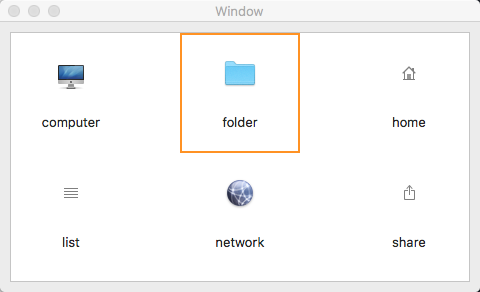

# NSCollectionViewDemo

#### `NSCollectionView`的简单使用示例，采用Storyboard+数据源(OS X10.11新增)的方式

NSCollectionView默认不能选中，必须将`isSelectable`属性设置为true，才能通过代理接收到用户选中(点击)的item

## 预览

## 环境

- macOS 10.11+
- Swift3.0+
- Xcode8.0+